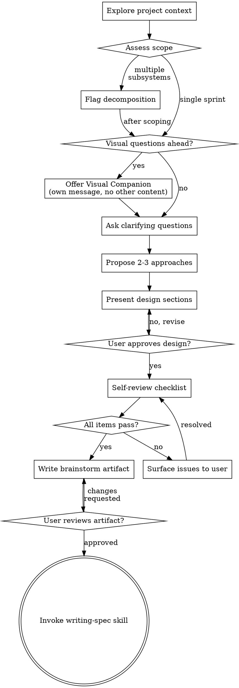

# Brainstorming Ideas Into Designs

Help turn ideas into fully formed designs through natural collaborative dialogue. The output is a **brainstorm artifact** — a structured summary of decisions, discoveries, and scope — not a spec. The spec is written by the `writing-spec` skill, which starts with fresh context and uses the artifact as its sole input.

## HARD-GATE

<HARD-GATE>
Do NOT invoke any implementation skill, write any code, scaffold any project, or take any implementation action until you have presented a design and the user has approved it. This applies to EVERY project regardless of perceived simplicity. Do NOT invoke `writing-spec` until the user has approved the brainstorm artifact.
</HARD-GATE>

## Anti-Pattern: "This Is Too Simple To Need A Design"

Every project goes through this process. A todo list, a single-function utility, a config change — all of them. "Simple" projects are where unexamined assumptions cause the most wasted work. The design can be short (a few sentences for truly simple projects), but you MUST present it and get approval.

## Process Flow



## Checklist

You MUST create a task for each of these items and complete them in order:

1. **Explore project context** — check files, docs, recent commits
2. **Assess scope** — if the request describes multiple independent subsystems, flag for decomposition before asking detailed questions
3. **Offer visual companion** (if topic involves visual questions) — own message only, wait for response
4. **Ask clarifying questions** — one at a time, understand purpose, constraints, success criteria
5. **Propose 2-3 approaches** — with tradeoffs and your recommendation
6. **Present design** — in sections scaled to complexity, get user approval after each section
7. **Self-review** — run the pre-write checklist; surface any failures to the user before writing
8. **Write brainstorm artifact** — save to `docs/brainstorms/YYYY-MM-DD-<topic>-brainstorm.md`, commit
9. **User reviews artifact** — present for review, wait for approval or changes
10. **Invoke writing-spec skill** — the only skill you invoke after brainstorming

## Self-Review Checklist (Step 7)

Before writing the artifact, check every item. If any fail, surface to the user before writing — do not write an artifact with unresolved issues baked in.

- [ ] Sprint goal fits one PR/sprint of work (not multiple independent concerns)
- [ ] Problem is grounded — verified against actual codebase, not assumed. "I think X works like Y" must become "X is at file.py:42 and does Y"
- [ ] All key decisions captured with their rationale (not just the outcome)
- [ ] Scope has explicit IN and explicit OUT — not just "we'll add X" but "we won't add Y in this sprint"
- [ ] Candidate FEAT-IDs are ≤ 5. If more needed, flag for decomposition into a follow-up sprint
- [ ] Open questions are listed explicitly — not buried in conversation history
- [ ] Technical discoveries (code snippets, API signatures, method locations) are documented so the spec-writing agent can reference them without the conversation context

## Brainstorm Artifact Format

Save to `docs/brainstorms/YYYY-MM-DD-<topic>-brainstorm.md`. Project preferences for location override this default.

```markdown
# [Topic] — Brainstorm Artifact

**Date**: YYYY-MM-DD
**Status**: DRAFT
**Sprint goal**: [one sentence — what ships in this sprint, scoped for one PR]

## Problem Statement

[Grounded problem. Verified against codebase. Include file:line references where applicable.]

## Technical Discoveries

[Code snippets, API signatures, method locations, patterns found during brainstorm.
Captured here so the spec-writing agent can use them without needing the conversation context.]

## Approach Selected

[Which option was chosen and why. If only one option was viable, say so.]

## Decisions

| Decision | Rationale |
|----------|-----------|
| ... | ... |

## Scope

### In Scope
- [explicit list]

### Out of Scope
- [explicit list — things that came up and were consciously excluded]

## Candidate FEAT-IDs

<!-- Max 5. If more needed, split into a follow-up sprint. -->
- FEAT-001: [Name] — [one-line description]

## Constraints & Dependencies

[Prerequisites, external dependencies, ordering constraints]

## Open Questions

<!-- Must be empty (all resolved) before invoking writing-spec -->
- [ ] [Question that needs resolution before the spec can be written]
```

## After Writing the Artifact

1. Commit the artifact to git
2. Present to user: "Brainstorm artifact written to `<path>`. Please review — in particular, check that the Open Questions section is empty and the scope feels right before I hand off to the spec writer."
3. Wait for approval or changes
4. Once approved: invoke `writing-spec` skill

**The only skill you invoke after brainstorming is `writing-spec`.** Do NOT invoke `writing-plans`, `writing-execution-prompts`, or any implementation skill directly. Do NOT write the spec yourself — that is the spec writer's job with fresh context.

## Key Principles

**One question at a time** — Don't overwhelm with multiple questions. If a topic needs more exploration, break it into multiple sequential questions.

**Multiple choice preferred** — Easier to answer than open-ended when options are known.

**Ground claims in code** — When proposing how to integrate with existing code, read the actual files first. Don't assume APIs, signatures, or patterns — verify them.

**YAGNI ruthlessly** — Remove unnecessary features from all designs. Every "nice to have" that makes it into the artifact is a spec requirement that makes the plan larger.

**Scope discipline** — Before asking detailed questions, assess whether the request describes multiple independent subsystems. If yes, flag for decomposition immediately. Don't spend questions refining a project that needs to be split first.

**Incremental validation** — Present design sections one at a time, get approval before moving on.

**Design for isolation and clarity** — Break systems into units that each have one clear purpose, communicate through well-defined interfaces, and can be understood and tested independently. For each unit: what does it do, how do you use it, what does it depend on?

**Explore before proposing** — Check the current project state first. Follow existing patterns. Where existing code has problems that affect the work, include targeted improvements as part of the design.

## Visual Companion

A browser-based companion for showing mockups, diagrams, and visual options during brainstorming. Not a mode — a tool available for questions that benefit from visual treatment.

**Offering the companion:** When you anticipate upcoming questions will involve visual content, offer it once as its own message — no other content in that message:

> "Some of what we're working on might be easier to explain if I can show it to you in a web browser. I can put together mockups, diagrams, comparisons, and other visuals as we go. This feature is still new and can be token-intensive. Want to try it? (Requires opening a local URL)"

**Per-question decision:** Even after the user accepts, decide for each question whether to use the browser or the terminal.

- **Use the terminal** for text content — requirements questions, conceptual choices, tradeoff lists, A/B text options, scope decisions
- **Use the browser** for visual content — mockups, wireframes, layout comparisons, architecture diagrams

**Interactive Playground:** When the topic involves relationships, flows, or topology, suggest the Playground plugin for interactive HTML exploration:

> "This involves a lot of interconnected parts. I can spin up an interactive playground where you can click through the relationships and explore visually. Want me to try that?"

Use Playground when the user would benefit from manipulating the visualization, not just seeing it. If a static diagram suffices, use the Visual Companion instead.

If the user agrees to the companion, read `skills/brainstorming/visual-companion.md` before proceeding.
