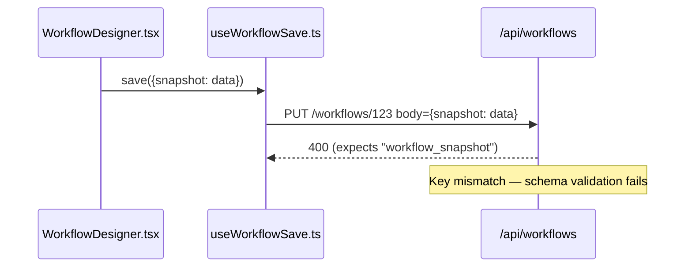

# Graph-Aware Code Review

Review code changes using parallel review agents with structural analysis.

**Two modes:**
- **PR mode:** `$ARGUMENTS` is a number (e.g., `86`, `#86`) → reviews a pull request, posts comment to PR
- **Local mode:** no arguments or `--staged` → reviews uncommitted local changes

## Instructions

Follow these phases precisely. Make a todo list first.

### Phase 1 — Pre-flight

1. **Detect mode** from `$ARGUMENTS`:
   - Numeric → PR mode. Strip `#` if present.
   - Empty or `--staged` → Local mode.
   - Other → use conversation context to resolve, or ask.

2. **Get the diff:**
   - PR mode: `gh pr diff <number>`
   - Local mode: `git diff` + `git diff --staged` (or `git diff --staged` only if `--staged`)

3. **If no changes found**, report that and stop.

4. **Get changed file list:**
   - PR mode: `gh pr diff <number> --name-only`
   - Local mode: `git diff --name-only` + `git diff --staged --name-only`

5. **Structural pre-flight** (if Agent Brain CLI is available):
   ```bash
   # Get blast radius for changed symbols
   agent-brain-cli impact <project-name> Symbol1 Symbol2 Symbol3
   ```
   Extract 5-10 key symbol names from the diff (class names, function names that were modified).
   If Agent Brain is unavailable, skip this step and note it in the output.

6. **Classify changed files by type** (used to route conditional checks to agents):

   | Category | Match Criteria |
   |----------|---------------|
   | `frontend` | `.tsx`, `.jsx`, `.vue`, `.svelte`, `.css`, `.html`; also `.ts`/`.js` under `web/`, `frontend/`, `client/` |
   | `backend-api` | Files containing route/endpoint definitions (`@app.post`, `router.get`, etc.) |
   | `backend-logic` | `.py`, `.go`, `.rs`, `.java`, `.ts` not matching `frontend` or `backend-api` |
   | `tests` | Files in `test/`, `tests/`, `__tests__/` dirs, or matching `test_*.py`, `*.test.ts`, `*.spec.ts` |
   | `docs` | `.md`, `.txt`, `.rst`, or files in `docs/` |
   | `config` | `.json`, `.yaml`, `.yml`, `.toml`, `.env`, `.ini` |

   Extension and path matching is sufficient — do not read file contents for classification.
   A file may match multiple categories. Pass this classification to all Phase 2 agents.

7. **Dead code scan** (if Agent Brain CLI is available):
   ```bash
   agent-brain-cli dead-code <project-name>
   ```
   Filter results to only include symbols defined in changed files. Ignore symbols in
   unchanged files — project-wide dead code is not this PR's problem.
   Pass filtered results to Agent 1 for verification.
   If Agent Brain is unavailable, skip this step and note it in the output.

8. **Find CLAUDE.md files:** root CLAUDE.md + any CLAUDE.md files in directories of changed files.

9. **Get PR metadata** (PR mode only): `gh pr view <number> --json title,body,author,labels`

10. **Extract scope metadata** (PR mode only):
    From the PR title, body, and linked issues, extract:
    - Stated purpose (first sentence or paragraph of body)
    - Linked issue numbers (`#NNN` references or GitHub linked issues)
    Pass this to Agent 3 for scope discipline checks.

11. **Detect linked spec/template:**
    Search for design docs that may apply to this change:
    - Paths referenced in PR description
    - Files in `docs/plans/` matching branch name or linked issue number
    - Template files referenced in recent commits on the branch
    If found, pass the spec path to Agent 1 for compliance checking. Do not read the
    spec yourself — Agent 1 will read it.

### Phase 2 — Parallel Review

Launch **4 parallel Sonnet agents**. Each agent receives:
- The diff (or relevant portions)
- The changed file list
- The structural context from Phase 1 (impact analysis results)

Each agent MUST include a `## Tools Used` section at the end listing every tool it called.

Each agent MUST also include a `## Files Examined` section listing every path from the
changed file list that the agent actually looked at, even if no issues were found in it.
The consolidator (Phase 2.5) uses this to detect silent coverage gaps — a changed file with
no `Files Examined` entry from any agent is a coverage hole. A bare path list is enough; no
per-file findings arrays required.

Tell each agent:

> **Structural analysis tools (use when investigating dependencies or blast radius):**
> If Agent Brain CLI is available in this project, you can use:
> - `agent-brain-cli impact <project> <symbol> [--depth N]` — blast radius / what depends on a symbol
> - `agent-brain-cli dead-code <project> [--kind function]` — unreferenced symbols
> - `agent-brain-cli query <project> --file <path>` — symbols in a file
> - `agent-brain-cli query <project> --arch` — architecture overview
> - `agent-brain-cli query <project> "search text"` — semantic search
>
> All output is JSON — pipe to `jq` for field extraction.
> Use these when investigating structural issues (dependency gaps, missing implementations,
> orphaned references). They are optional — use them when they would strengthen your analysis.
> If they are not available, fall back to grep/glob-based analysis.

#### Agent 1 — Structural Completeness

Focus: dependency gaps, missing interface implementations, orphaned references.

You received impact analysis results showing what depends on the changed symbols.
Your job is to verify that ALL dependents are properly handled. Specifically:

- Are all subclasses/implementations updated when a base class changes?
- Are all callers updated when a function signature changes?
- Are test fixtures and mocks updated to match new interfaces?
- Are there new symbols that nothing references (potential dead code)?

Use `agent-brain-cli impact` to dig deeper on specific symbols.

**Dead code verification:** You received filtered dead code candidates from pre-flight
step 7. For each candidate, classify it:
- **Introduced by this PR** (new symbol in the diff that nothing references) → flag as issue
- **Pre-existing** (existed before this PR) → ignore, not this PR's problem
- **False positive** (dynamically referenced, exported API, test fixture) → ignore
Use `git diff` to determine whether the symbol was introduced or modified by this PR.
Only flag dead code that this PR introduced.

**Schema completeness:** For any new DDL (CREATE TABLE, ALTER TABLE), verify:
- NOT NULL on columns that should never be NULL (booleans, timestamps, required fields)
- Indexes match the query patterns used by new code
- Default values are consistent with what the application code writes

**Spec compliance:** If pre-flight step 11 detected a linked design doc or template,
read it and verify:
- All spec requirements addressable by this PR are implemented
- Implementation does not contradict spec decisions
- No claimed spec items are missing from the implementation
Skip items clearly assigned to a different implementation phase.
If no spec was detected, skip this check.

Return a list of issues with file:line and explanation.

#### Agent 2 — Bugs & Logic

Focus: logic errors, race conditions, null/undefined handling, edge cases, resource leaks.

Read the diff AND the full modified files for context (not just the changed lines).
Focus on significant bugs that will impact functionality in practice. Avoid nitpicks.

You can use `agent-brain-cli impact` to check whether callers of a changed function handle
the new behavior correctly.

**Severity classification:** Classify each finding you report:
- **Critical** — will cause data loss, incorrect behavior, or security vulnerability in production
- **Warning** — likely to cause problems under specific conditions (edge cases, race conditions, error paths)
- **Minor** — code quality or minor robustness issue, won't break functionality

**Failure-path diagrams:** For every issue you classify as Critical, you MUST produce a
mermaid sequence diagram tracing the failure path. The diagram must include:
1. The entry point (API call, user action, event trigger)
2. Each function/component the data passes through (with file references)
3. The exact point where the failure occurs
4. What the caller expects vs what it actually receives

This diagram is part of your analysis, not just output formatting. If you cannot construct
the diagram, investigate further — inability to trace the path may indicate the issue is
not real. Do NOT produce diagrams for non-Critical issues.

Example:


**Conditional checklist** — apply these ONLY when the file-type classification from
pre-flight step 6 includes the matching category:

When `backend-api` files are changed:
- Non-idempotent operations (POST, DELETE) wrapped in retry logic without deduplication keys
- Inconsistent or incorrect HTTP status codes for the operation type
- Missing error response bodies or inconsistent error formats

When `frontend` files are changed:
- Clickable elements (`onClick`) on non-interactive elements (`div`, `span`) without `role`, `tabIndex`, or `onKeyDown`
- Custom interactive controls missing `aria-label`, `aria-expanded`, or equivalent
- Components that fetch data but don't handle loading/error states

When async/concurrent patterns are present (any file type):
- State updates that depend on async results (IDs, tokens) where rapid user actions could fire before the result arrives
- Subscriptions, timers, or in-flight requests not cleaned up on unmount or scope exit
- Optimistic UI updates without rollback on failure

Do NOT apply a conditional checklist when its file-type trigger is absent.
Conditional checklist findings use the same severity scale (Critical/Warning/Minor).

**Systematic checks** — apply these per-site, not per-diff. For each check below, enumerate
every site in the diff matching the trigger, then apply the check to each site. Do not stop
at the first site noticed. Emit a finding OR an explicit "checked, no issue" record per site
so coverage is auditable.

- **Exception type hierarchies:** *For each site* using `asyncio.timeout`, `contextlib.suppress`,
  or other exception-based control flow, verify the enclosing `except` clauses distinguish the
  specific exception from broad catches like `except Exception`. Example: `asyncio.timeout`
  raises `TimeoutError` — if an outer `except Exception` catches it, timeout handling is
  silently wrong. List every site you checked.
- **Error isolation at every call level:** *For each site* where the code claims error isolation
  (one component's failure doesn't block others), walk the call chain and verify the isolation
  exists at every level, not just the innermost. A try/except inside a function is not isolation
  if the caller's loop doesn't also wrap the call. Name each call chain you walked.
- **Cross-instance consistency:** When you flag an issue on one instance of a pattern (e.g., a
  missing date window on one detector), *enumerate every sibling instance of the same pattern in
  the diff* and report the check result on each — found issue, verified OK, or unable to determine.
  Don't stop at the first.
- **SQL DDL constraints:** *For each new `CREATE TABLE` or `ALTER TABLE` adding columns*, verify
  NOT NULL constraints on columns that should never be NULL (especially booleans, timestamps,
  required foreign keys). List every DDL statement you evaluated.

Return a list of issues with severity, file:line, and explanation.
Include the mermaid diagram inline for each Critical issue.

#### Agent 3 — Compliance & Conventions

Focus: CLAUDE.md rules, code comment guidance, naming conventions, project patterns.

Read the CLAUDE.md files found in Phase 1. Note that CLAUDE.md is guidance for Claude
as it writes code — not all instructions are applicable during code review.

Check:
- Do changes comply with explicit CLAUDE.md rules?
- Do changes comply with guidance in code comments (TODOs, warnings, notes)?
- Are there patterns in the codebase that the changes violate?

**Documentation accuracy:** If the PR modifies CHANGELOG, README, or doc files alongside
code changes, verify the descriptions match actual implementation behavior. Example: a
CHANGELOG entry saying "detects X within a session" when the code actually works "across
sessions" is a documentation bug.

Return a list of compliance issues with file:line, the specific rule violated, and explanation.

**Scope discipline** (PR mode only):
Compare the changed files against the scope metadata from pre-flight step 10.
Flag files or changes that appear unrelated to the PR's stated purpose.

Rules:
- Do NOT flag test files that correspond to changed implementation files — tests are always in scope
- Err on the side of not flagging — only surface files clearly unrelated to the stated purpose
- When in doubt, don't flag

Scope findings are **advisory only** — report them in a separate section at the end of
your output, clearly marked as "Scope Notes (advisory)". They are NOT compliance issues
and will NOT be scored in Phase 3. Keep them separate from your compliance findings.

Skip this check entirely in local mode.

#### Agent 4 — Historical Context

Focus: prior-PR echoes and dismissed reviewer comments that may have resurfaced.
Narrowed from "interpret git history" because generic blame commentary rarely produces
actionable findings. Restrict yourself to the two specific signals below.

**Scope — do only these two things:**

1. **Prior-PR touches on the same symbols.** For each symbol changed in this diff, find prior
   PRs that modified the same symbol or file. Pull their reviewer comments. Flag any concern
   raised then that appears to apply to the current change — same pattern, same risk surface.
   Cite the prior PR number and the specific comment.

2. **Dismissed / unaddressed comments resurfacing.** For each file in this diff, scan prior PRs
   touching it for reviewer comments that were dismissed (resolved without code change),
   declined, or left unanswered. If the current change re-introduces the pattern the prior
   comment flagged, surface it — the prior dismissal does NOT mean the concern was wrong, and
   the Prior-Review Floor rule in Phase 3 will score it accordingly.

Do NOT produce generic "this file has a long history" or "this pattern was established in
commit X" commentary. If you cannot cite a specific prior reviewer comment or a concrete
prior-PR concern that re-applies, report nothing for that file.

Return a list of issues with file:line, the prior-PR reference (number + commit SHA), and
explanation of why the prior concern applies now.

### Phase 2.5 — Consolidator

The four specialists ran in parallel; none saw the others' output. This phase is the only
one whose job is cross-specialist integration — finding issues that emerge *only* when
you see all the findings together.

Launch **one serial Sonnet agent** (read-only). Give it:
- The full Phase 2 output from all four agents (findings + `## Files Examined` + `## Tools Used`)
- The changed file list
- The diff
- The impact analysis results from Phase 1

Tool budget: `agent-brain-cli query/impact`, `grep`, `git show`. Do NOT re-read source files
already covered by the specialists — this phase integrates, it doesn't re-review.

Instructions to the consolidator (paste verbatim):

> You are NOT re-evaluating whether the specialists' findings are correct — that's Phase 3.
> Your job is to find issues the specialists missed because each was looking at one dimension.
> Do four things in order:
>
> 1. **Cross-instance sweep.** For each specialist finding, check whether the same pattern
>    exists elsewhere in the diff that wasn't flagged. Use `agent-brain-cli query` or `grep`
>    to find sibling occurrences. If the pattern is wrong in one place, it's likely wrong in
>    others. Emit any missed sibling as a new finding.
>
> 2. **Cross-cutting integration.** Look for issues that require two specialists' views at once.
>    Example: Agent 1 found a new symbol. Agent 2 didn't null-check its callers because Agent 2
>    was focused on changed lines. The cross-cutting issue is "new symbol X is assumed non-null
>    by caller Y, but X can return null on error path Z." Only surface issues that require
>    integrating outputs — if one specialist could have found it alone, skip.
>
> 3. **Coverage audit.** Walk the changed file list. For each file, check whether it appears
>    in at least one agent's `## Files Examined` section. For any file that does NOT appear,
>    read the diff for that file and judge: is the silence correct (file really is fine) or
>    suspicious (non-trivial change nobody reviewed)? Flag suspicious silences as findings.
>
> 4. **Contradiction check.** Scan for findings where two specialists disagree — e.g., Agent 2
>    calls pattern X a bug while Agent 4 cites a prior PR where X was chosen deliberately.
>    Surface the contradiction as a distinct finding so Phase 3 can weigh both sides.
>
> **Dedup rule:** If something you notice is only cosmetically different from a finding a
> specialist already made, DROP it. Redundancy distorts Phase 3's relative-ranking scoring
> since the rubric considers the batch together.
>
> Return new findings using the same schema as the specialists (file:line, severity, explanation,
> mermaid diagram if Critical). Do NOT re-report findings the specialists already made.
> Include a `## Tools Used` section. Include a `## Integration Notes` section summarizing
> what you checked and what you explicitly decided was fine (audit trail).

### Phase 2.75 — Context Enrichment

Mechanical batch step, no LLM. For every finding from Phase 2 + Phase 2.5 that has a
`file:line` anchor:

1. Extract the hunk from the diff that contains the line.
2. Read the surrounding file context: line − 20 to line + 20 (clamp to file bounds).
3. Attach both as `diff_hunk` and `file_context` fields on the finding before Phase 3 sees it.

This gives Phase 3 a verifiable local window per issue without requiring each scorer to
scan the full diff for the right hunk. Batch this centrally — do not make each specialist
emit context, or you get inconsistency and duplicate reads.

Findings that cannot be mapped to a diff line (e.g., "missing code that should exist")
skip enrichment and flow through to Phase 3 with only their description.

### Phase 3 — Scoring

Collect **all issues** from Phase 2 and Phase 2.5 (excluding Agent 3's advisory scope notes),
enriched by Phase 2.75 with diff hunks + file context, and launch **one or two parallel Sonnet
agents** to score the full batch. Each agent receives
all issues together so it can rank relative importance — an issue that looks minor in
isolation may be the most important finding when seen alongside the others.

Scoring uses Sonnet (not Haiku) because this is the quality gate that determines output
noise vs signal — Sonnet's stronger reasoning reduces false positives and preserves real bugs.

Give each scoring agent:
- The **full list of issues** to score (with descriptions and mermaid diagrams if present)
- The diff context
- The CLAUDE.md file paths

If there are more than 8 issues, split into two parallel batches to stay within context.

**Diagram-aware scoring:** When an issue includes a mermaid failure-path diagram, use it
to verify the trace is plausible — do the participants (files/functions) exist? Does the
data flow match the actual code? A well-constructed diagram supports high confidence; a
diagram that doesn't hold up to scrutiny reduces confidence.

Scoring rubric (give this verbatim to each agent):

> Score each issue on a scale from 0-100. You are scoring the full batch together —
> consider each issue relative to the others.
>
> - 0: False positive. Doesn't hold up to scrutiny, or is a pre-existing issue not
>   introduced by this change.
> - 25: Might be real, might be false positive. Couldn't verify. Or: stylistic issue
>   not mentioned in CLAUDE.md.
> - 50: Real but low-impact in practice. Would not cause incorrect behavior, data loss,
>   or security issues under normal conditions.
> - 75: Verified real. Will cause incorrect behavior, data loss, or security issues under
>   specific conditions. Or: directly violates an explicit CLAUDE.md rule.
> - 100: Verified real AND high-impact. Will cause problems frequently or under common
>   scenarios. Evidence directly confirms the failure path.
>
> **TODO/FIXME floor rule:** If the code itself contains a TODO, FIXME, or comment
> acknowledging the exact gap that the issue describes, the issue is **confirmed real
> by the author** — they placed that marker because they knew it was a problem. Score
> these at minimum 85. Score higher (90-100) if the acknowledged gap has a plausible
> failure path (data loss, silent errors, resource leaks). Do NOT treat author
> acknowledgment as evidence that the risk was "accepted" — treat it as evidence
> the issue is definitely real.
>
> **Prior-Review Floor rule:** If Agent 4 (Historical Context) reports that a prior PR's
> reviewer comment flagged this exact issue and the comment was dismissed, declined, or
> left unaddressed, score at minimum 80. Human reviewers don't re-flag things casually —
> treat the re-surfacing as evidence the issue is real and the prior dismissal was wrong.
> This rule requires the finding to cite a specific prior-PR comment (number + SHA),
> not generic historical commentary.
>
> **CLAUDE.md issues:** Double-check that CLAUDE.md actually calls out this issue
> specifically. A general "good practice" not in CLAUDE.md scores lower than one
> explicitly required.

**Filter:** discard all issues scoring below 75.

**False positives to watch for:**
- Pre-existing issues not introduced by this change
- Issues a linter, typechecker, or compiler would catch
- Pedantic nitpicks a senior engineer wouldn't flag
- General quality issues unless explicitly required in CLAUDE.md
- Issues silenced by lint-ignore comments in the code
- Changes in functionality that are likely intentional
- Real issues but on lines not modified in this change

### Phase 4 — Output

**Always** output the full report to the terminal.

**PR mode additionally:** post as an inline PR review (not a plain comment).

#### Step 4a — Build review payload

For each scored issue from Phase 3, create a review comment object:

```json
{
  "path": "src/file.py",
  "line": 42,
  "body": "**[Critical]** Brief description\n\nExplanation + suggested fix"
}
```

**Line number rules:**
- The `line` must appear in the PR diff (a changed or added line). Use `gh pr diff <number>`
  to verify. If the issue is on an unchanged line, use the nearest changed line in the
  same hunk and note "Issue is on nearby line N" in the body.
- If the issue cannot be mapped to any diff line (e.g., a missing-code issue), include it
  in the review body summary instead.
- Include mermaid failure-path diagrams in the comment body for Critical issues.

#### Step 4b — Submit the review

Get the head SHA first, then submit:

```bash
# Get head SHA
HEAD_SHA=$(gh pr view <number> --json headRefOid -q .headRefOid)

# Submit review with inline comments
gh api repos/{owner}/{repo}/pulls/<number>/reviews \
  --method POST \
  -f commit_id="$HEAD_SHA" \
  -f event="COMMENT" \
  -f body="<summary body>" \
  -f 'comments[0][path]=src/file.py' \
  -f 'comments[0][line]=42' \
  -f 'comments[0][body]=Issue description'
```

For multiple comments, increment the array index: `comments[0]`, `comments[1]`, etc.

**The summary body** (the `-f body=` field) should contain:

```
### Code Review

**Summary:** [2-3 sentences on what changed]

**Structural Impact:** [blast radius — N dependents, key relationships, dead code introduced, or "no structural concerns"]

Found N issues (posted as inline comments).

| File | Summary |
|------|---------|
| path/to/file.py | What changed, clean or has issues |

**Confidence: N/5** — [one sentence reasoning]

Generated with [Claude Code](https://claude.ai/code)
```

**Scope Notes** (advisory, not scored) go in the summary body, not as inline comments:
```
---
**Scope Notes** (advisory)
- `path/to/file` — why it appears out of scope
```

Omit scope notes section entirely if none found.

#### No issues found

If no issues survive scoring, post a simple review:

```bash
gh api repos/{owner}/{repo}/pulls/<number>/reviews \
  --method POST \
  -f commit_id="$HEAD_SHA" \
  -f event="COMMENT" \
  -f body="### Code Review

No significant issues found. Checked for: structural completeness, bugs, CLAUDE.md compliance, historical context.

**Structural Impact:** [brief summary]

Generated with [Claude Code](https://claude.ai/code)"
```

#### Local mode output

Local mode outputs the full report to the terminal only (no GitHub API calls).
Use the same severity grouping (Critical, Warning, Minor) with file:line references.

#### PR Comment Rules

- Keep inline comments focused — one issue per comment, with suggested fix
- No emojis
- Use full git SHA in file links (not HEAD or short SHA)
- Mermaid diagrams go in the inline comment for Critical issues, not the summary

## Integration with Workflows

**Subagent-Driven Development:** review after EACH task (lighter version via code-quality-reviewer-prompt.md)
**Executing Plans:** review after each batch
**Ad-Hoc Development:** review before merge, when stuck, after complex bug fix

**Related skills:**
- **superpowers:receiving-code-review** - How to handle review feedback
- **superpowers:verification-before-completion** - Evidence before claims
