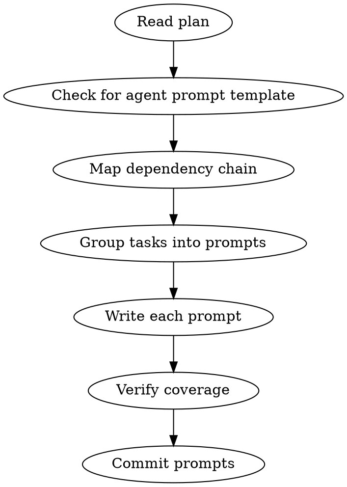

# Writing Execution Prompts

Decompose an implementation plan into numbered, self-contained prompt files that agents can execute independently.

## When to Use

- Implementation plan exists with tasks/chunks and spec IDs
- User wants to dispatch work to agents (subagents, worktrees, or new sessions)
- After writing-plans skill completes and plan is approved

**Not for:** Writing the plan itself (use superpowers:writing-plans), single-task prompts, or ad-hoc requests.

## Core Pattern

```
Plan (tasks + specs) → Check template → Identify boundaries → Write numbered prompts → Commit
```



## Prompt Granularity

Each prompt = one dispatchable unit of work for a single agent session.

| Signal | Action |
|--------|--------|
| Tasks share files and must be sequential | Combine into one prompt |
| Tasks touch independent files | Separate prompts (can parallelize) |
| A task changes an interface others depend on | Own prompt, mark as dependency |
| >5 file modifications in one prompt | Split unless they're trivially related |
| Single file change with tests | One prompt is fine |

**Rule of thumb:** If an agent needs >30 minutes or >3 commits, the prompt is too big.

## Atomicity and Parallelism

**A prompt marked "parallel" MUST be truly atomic — zero file overlap with any concurrent prompt.**

Before marking prompts as parallel, verify:
1. **No shared files** — if prompt 03a and 03b both modify the same file, they are NOT parallel
2. **No shared intermediate state** — if 03a creates a type that 03b imports, they are sequential
3. **No import chain overlap** — if both prompts update imports in the same barrel file, one goes first

**When in doubt, make it sequential.** The cost of unnecessary sequencing is minutes. The cost of a broken parallel dispatch is debugging merge conflicts and stomped state.

## Prompt Template

<HARD-GATE>
Before writing ANY prompt, you MUST:
1. Read `docs/prompts/CLAUDE.md` if it exists — project-specific prompt conventions
2. Glob for `docs/templates/*agent*` and `docs/templates/*prompt*` — read any matches
3. Use the project template as the prompt structure. There is no fallback structure
   in this skill. If the project has no template, ask the user which format to use.
</HARD-GATE>

Every prompt header MUST include these dependency/parallelism fields:
```
> **Plan**: `path/to/plan.md` Tasks N-M
> **Specs**: SPEC-IDs covered
> **Depends on**: Prompt NN (or "None — can run first")
> **Parallel**: Yes/No — can run alongside prompt NN
```

## Dependency Chain

Always state dependencies in prompt headers. Common patterns:

```
01 ──→ 02 ──→ 03 ──→ 04 ──→ 05    (sequential)
01 ──→ 02 ──┬→ 03a ──┬→ 05         (fan-out/fan-in)
            └→ 03b ──┘
            └→ 03c ──┘
```

## Bookend Prompts

Every prompt sequence includes two bookend prompts:

**`00-setup-branch.md`** — Always first. Creates the feature branch.

**`NN-synchronize.md`** — Always last. Updates docs, marks design doc COMPLETE,
triggers `finishing-a-development-branch` skill.

## Output Location

Save prompts to `docs/prompts/<feature-name>/`:
```
docs/prompts/<feature-name>/
├── 00-setup-branch.md
├── 01-foundation.md
├── 02-core-change.md
├── 03-consumers.md
├── 04-cleanup.md
└── NN-synchronize.md
```

## Quick Reference

| Step | Action |
|------|--------|
| 1 | Read plan — identify tasks, chunks, spec IDs, file list |
| 2 | Check `docs/templates/` for agent prompt template |
| 3 | Map dependencies — which tasks depend on which? |
| 4 | Group into prompts — one per dispatchable unit |
| 5 | Number sequentially — `01-name.md`, `02-name.md` |
| 6 | Write each prompt — follow structure above |
| 7 | Add final verification prompt — full test suite + dead reference search |
| 8 | Save to `docs/prompts/<feature>/` |
| 9 | Commit all prompts together |

## Post-Write Checklist

After writing ALL prompts, verify each one passes this checklist. Fix before committing.

- [ ] Follows the project's agent prompt template structure (not a custom format)
- [ ] Header has Plan, Specs, Depends on, Parallel fields
- [ ] Context section with project-specific queries (e.g., Agent Brain CLI)
- [ ] Problem — one sentence
- [ ] Targets — files with CREATE/MODIFY/READ
- [ ] Requirements — spec IDs + explicit out of scope
- [ ] Deliverables end with the project template's mandatory sections (report, assumptions, evidence, code review — whatever the template requires)
- [ ] Start — action verb + first step

## Common Mistakes

| Mistake | Fix |
|---------|-----|
| Prompt assumes context from prior prompts | Each prompt is self-contained |
| No verification commands | Every prompt ends with exact commands + expected output |
| Missing spec IDs | Every prompt references which specs it implements |
| Combining interface change + consumers | Interface change in own prompt, consumers in next |
| Forgetting cleanup prompt | Cleanup is its own prompt, runs after consumers migrate |
| No final verification prompt | Always end with sweep: tests, type check, dead reference search |
