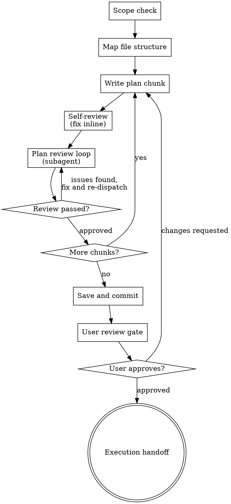

# Writing Plans

## Overview

Write comprehensive implementation plans assuming the engineer has zero context for our codebase and questionable taste. Document everything they need to know: which files to touch for each task, code, testing, docs they might need to check, how to test it. Give them the whole plan as bite-sized tasks. DRY. YAGNI. TDD. Frequent commits.

Assume they are a skilled developer, but know almost nothing about our toolset or problem domain. Assume they don't know good test design very well.

**Announce at start:** "I'm using the writing-plans skill to create the implementation plan."

**Context:** This should be run in a dedicated worktree (created by brainstorming skill).

**Save plans to:** `docs/superpowers/plans/YYYY-MM-DD-<feature-name>.md`
- (User preferences for plan location override this default)

<HARD-GATE>
Do NOT hand off the plan for execution, save it as "complete", or invoke any execution skill until the plan review loop has passed AND the user has approved the plan. A plan that has not been reviewed is not complete. A plan that has not been approved by the user is not ready for execution.
</HARD-GATE>

## Checklist

You MUST create a task for each of these items and complete them in order:

1. **Scope check** — if spec covers multiple independent subsystems, break into separate plans
2. **Map file structure** — use Agent Brain (if available) for dependency/impact analysis
3. **Write plan chunks** — tasks with exact file paths, code, commands, expected output
4. **Self-review** — quick inline check for placeholders, spec coverage, type consistency, API verification
5. **Plan review loop** — dispatch plan-document-reviewer for EVERY chunk; fix issues and re-dispatch until approved (max 5 iterations, then surface to human)
6. **Save and commit plan** — only after ALL chunks pass review
7. **User review gate** — present plan to user, wait for approval
8. **Execution handoff** — only after user approves, proceed to execution

## Process Flow



## Scope Check

If the spec covers multiple independent subsystems, it should have been broken into sub-project specs during brainstorming. If it wasn't, suggest breaking this into separate plans — one per subsystem. Each plan should produce working, testable software on its own.

## File Structure

Before defining tasks, map out which files will be created or modified and what each one is responsible for. This is where decomposition decisions get locked in.

**If Agent Brain CLI is available:** run `agent-brain-cli impact <project> <symbol>`
on key symbols you plan to change. This reveals the actual dependency graph and
blast radius — ensuring your file list is complete and your task boundaries don't
split tightly-coupled code.

- Design units with clear boundaries and well-defined interfaces. Each file should have one clear responsibility.
- You reason best about code you can hold in context at once, and your edits are more reliable when files are focused. Prefer smaller, focused files over large ones that do too much.
- Files that change together should live together. Split by responsibility, not by technical layer.
- In existing codebases, follow established patterns. If the codebase uses large files, don't unilaterally restructure - but if a file you're modifying has grown unwieldy, including a split in the plan is reasonable.

This structure informs the task decomposition. Each task should produce self-contained changes that make sense independently.

## Bite-Sized Task Granularity

**Each step is one action (2-5 minutes):**
- "Write the failing test" - step
- "Run it to make sure it fails" - step
- "Implement the minimal code to make the test pass" - step
- "Run the tests and make sure they pass" - step
- "Commit" - step

## Plan Document Header

**Every plan MUST start with this header:**

```markdown
# [Feature Name] Implementation Plan

> **For agentic workers:** REQUIRED SUB-SKILL: Use superpowers:subagent-driven-development (recommended) or superpowers:executing-plans to implement this plan task-by-task. Steps use checkbox (`- [ ]`) syntax for tracking.

**Goal:** [One sentence describing what this builds]

**Architecture:** [2-3 sentences about approach]

**Tech Stack:** [Key technologies/libraries]

---
```

## Task Structure

````markdown
### Task N: [Component Name]

**Files:**
- Create: `exact/path/to/file.py`
- Modify: `exact/path/to/existing.py:123-145`
- Test: `tests/exact/path/to/test.py`

- [ ] **Step 1: Write the failing test**

```python
def test_specific_behavior():
    result = function(input)
    assert result == expected
```

- [ ] **Step 2: Run test to verify it fails**

Run: `pytest tests/path/test.py::test_name -v`
Expected: FAIL with "function not defined"

- [ ] **Step 3: Write minimal implementation**

```python
def function(input):
    return expected
```

- [ ] **Step 4: Run test to verify it passes**

Run: `pytest tests/path/test.py::test_name -v`
Expected: PASS

- [ ] **Step 5: Commit**

```bash
git add tests/path/test.py src/path/file.py
git commit -m "feat: add specific feature"
```
````

## No Placeholders

Every step must contain the actual content an engineer needs. These are **plan failures** — never write them:
- "TBD", "TODO", "implement later", "fill in details"
- "Add appropriate error handling" / "add validation" / "handle edge cases"
- "Write tests for the above" (without actual test code)
- "Similar to Task N" (repeat the code — the engineer may be reading tasks out of order)
- Steps that describe what to do without showing how (code blocks required for code steps)
- References to types, functions, or methods not defined in any task

## Remember
- Exact file paths always
- Complete code in every step — if a step changes code, show the code
- Exact commands with expected output
- DRY, YAGNI, TDD, frequent commits

## Self-Review (Pre-Screening)

After writing each chunk, do a quick self-check before dispatching the subagent reviewer:

**1. Spec coverage:** Skim each section/requirement in the spec. Can you point to a task that implements it? List any gaps.

**2. Placeholder scan:** Search your plan for red flags — any of the patterns from the "No Placeholders" section above. Fix them.

**3. Type consistency:** Do the types, method signatures, and property names you used in later tasks match what you defined in earlier tasks? A function called `clearLayers()` in Task 3 but `clearFullLayers()` in Task 7 is a bug.

**4. API verification:** For every `object.method()` call in code blocks, have you verified the method exists? Run `agent-brain-cli impact <project> <ClassName>` or read the source file. If you cannot point to the file:line where a method is defined, it cannot be in the plan.

Fix any issues inline, then proceed to the mandatory review loop.

## Plan Review Loop

**This step is MANDATORY — not advisory.** You MUST dispatch the reviewer for **every chunk** before proceeding. Do not select "the most critical chunks" — review all of them.

After self-review, for each chunk of the plan, dispatch the reviewer using this exact prompt structure. Do not write a custom prompt — use this template:

```
Agent tool (general-purpose):
  description: "Review plan chunk N"
  prompt: |
    You are a plan document reviewer. Verify this plan chunk is complete,
    grounded in the codebase, and ready for a zero-context agent to execute.

    **Plan chunk to review:** [PLAN_FILE_PATH] - Chunk N only
    **Spec for reference:** [SPEC_FILE_PATH]
    **Codebase root:** [CODEBASE_ROOT]

    ## What to Check

    | Category | What to Look For |
    |----------|------------------|
    | Completeness | TODOs, placeholders, `...` in code blocks, incomplete tasks |
    | Spec Alignment | Chunk covers relevant spec requirements, every spec ID has a task |
    | Groundedness | Code references real symbols, methods, and APIs — verify against codebase |
    | Integration Points | Referenced functions exist in the plan or in the codebase |
    | Test Completeness | Every feature has tests, fixtures are accessible |

    ## CRITICAL — Groundedness Checks

    Before approving, you MUST verify these against the actual codebase:

    1. **API accuracy**: When the plan calls `object.method()`, verify that
       method exists on that object. Read the source file or run
       `agent-brain-cli impact <project> <ClassName>`. Wrong method names
       cause immediate runtime failures for executing agents.

    2. **No placeholder code**: Search for `...` in code blocks. Every code
       snippet must be complete enough to execute.

    3. **Function existence**: When a task imports or calls a function defined
       in another task, verify the dependency is captured in task ordering.

    4. **Test fixture scope**: When tests reference fixtures, verify they are
       defined in the same class, at module level, or in conftest.py.

    5. **Mock fidelity**: When tests set `mock.method = AsyncMock(...)`,
       verify that method exists on the real class being mocked.

    Use grep, glob, and file reads to verify claims. Use `agent-brain-cli`
    if available.

    ## Severity Calibration

    1. **High**: Runtime failure for executing agent (wrong API, missing
       function, broken compatibility, placeholder code)
    2. **Medium**: Confusion or improvisation needed (missing commit, vague
       test, undefined fixture)
    3. **Low**: Style, naming, wording

    Approve unless there are High severity issues.

    ## Output Format

    ## Plan Review - Chunk N

    **Status:** Approved | Issues Found

    **Issues (if any):**
    - [Severity] [Task X, Step Y]: [specific issue] - [why it matters]

    **Recommendations (advisory):**
    - [suggestions]
```

**Review loop:**

1. Dispatch the reviewer for each chunk using the template above
2. If Issues Found: fix the issues, re-dispatch for that chunk
3. If Approved: proceed to next chunk
4. Repeat until ALL chunks are approved

**Chunk boundaries:** Use `## Chunk N: <name>` headings to delimit chunks. Each chunk should be ≤1000 lines and logically self-contained.

**Review loop guidance:**
- Same agent that wrote the plan fixes it (preserves context)
- If loop exceeds 5 iterations, surface to human for guidance
- Groundedness issues (wrong API names, missing functions, broken compatibility) MUST be fixed — these are not advisory

## Save and Commit

Only after ALL chunks have passed review, save and commit the plan.

Do NOT commit the plan before the review loop completes. Do NOT run the review in the background and commit while it is still running.

## User Review Gate

After the plan is committed, present it to the user for review before proceeding:

> "Plan reviewed and committed to `<path>`. [N] chunks reviewed, [summary of issues found and fixed]. Please review the plan and let me know if you want to make any changes before we proceed to execution."

**Wait for the user's response.** If they request changes, make them and re-run the review loop on affected chunks. Only proceed once the user approves.

## Execution Handoff

Only after the user has approved the plan, offer execution choice:

**"Two execution options:**

**1. Subagent-Driven (recommended)** - I dispatch a fresh subagent per task, review between tasks, fast iteration

**2. Inline Execution** - Execute tasks in this session using executing-plans, batch execution with checkpoints

**Which approach?"**

**If Subagent-Driven chosen:**
- **REQUIRED SUB-SKILL:** Use superpowers:subagent-driven-development
- Fresh subagent per task + two-stage review

**If Inline Execution chosen:**
- **REQUIRED SUB-SKILL:** Use superpowers:executing-plans
- Batch execution with checkpoints for review
