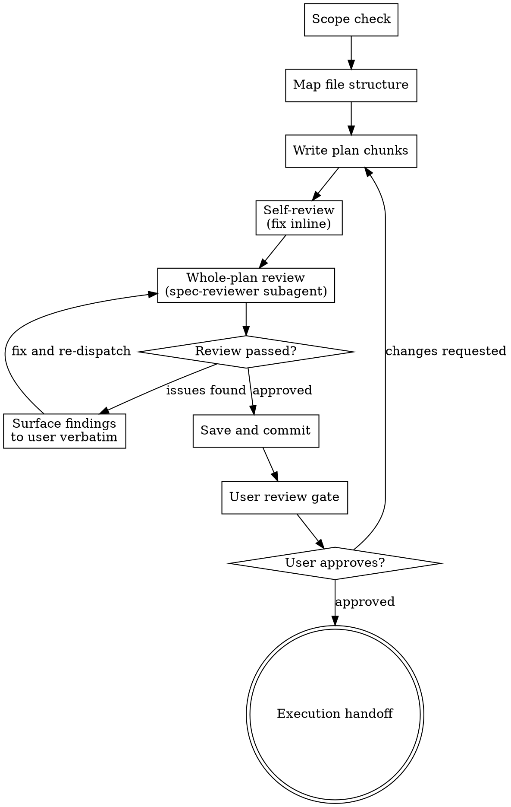

# Writing Plans

## Overview

Write comprehensive implementation plans assuming the engineer has zero context for our codebase and questionable taste. Document everything they need to know: which files to touch for each task, code, testing, docs they might need to check, how to test it. Give them the whole plan as bite-sized tasks. DRY. YAGNI. TDD. Frequent commits.

Assume they are a skilled developer, but know almost nothing about our toolset or problem domain. Assume they don't know good test design very well.

**Announce at start:** "I'm using the writing-plans skill to create the implementation plan."

**Context:** This should be run in a dedicated worktree (created by brainstorming skill).

**Save plans to:** `docs/superpowers/plans/YYYY-MM-DD-<feature-name>.md`
- (User preferences for plan location override this default)

<HARD-GATE>
Do NOT hand off the plan for execution, save it as "complete", or invoke any execution skill until the plan review loop has passed AND the user has approved the plan. A plan that has not been reviewed is not complete. A plan that has not been approved by the user is not ready for execution.
</HARD-GATE>

## Checklist

You MUST create a task for each of these items and complete them in order:

1. **Scope check** — if spec covers multiple independent subsystems, break into separate plans
2. **Map file structure** — use Agent Brain (if available) for dependency/impact analysis
3. **Write plan chunks** — tasks with exact file paths, code, commands, expected output
4. **Self-review** — quick inline check for placeholders, spec coverage, type consistency, API verification, **failure-mode discipline (state lifecycle, restart, atomicity, rare events)**
5. **Plan review** — dispatch `superpowers:spec-reviewer` ONCE over the whole plan; fix issues and re-dispatch until approved (max 5 iterations, then surface to human). **Surface High/Medium findings verbatim to the user; do not summarize, filter, or downgrade.**
6. **Save and commit plan** — only after the review approves
7. **User review gate** — present plan to user, wait for approval
8. **Execution handoff** — only after user approves, proceed to execution

## Process Flow



## Scope Check

If the spec covers multiple independent subsystems, it should have been broken into sub-project specs during brainstorming. If it wasn't, suggest breaking this into separate plans — one per subsystem. Each plan should produce working, testable software on its own.

## File Structure

Before defining tasks, map out which files will be created or modified and what each one is responsible for. This is where decomposition decisions get locked in.

**If Agent Brain CLI is available:** run `agent-brain-cli impact <project> <symbol>`
on key symbols you plan to change. This reveals the actual dependency graph and
blast radius — ensuring your file list is complete and your task boundaries don't
split tightly-coupled code.

- Design units with clear boundaries and well-defined interfaces. Each file should have one clear responsibility.
- You reason best about code you can hold in context at once, and your edits are more reliable when files are focused. Prefer smaller, focused files over large ones that do too much.
- Files that change together should live together. Split by responsibility, not by technical layer.
- In existing codebases, follow established patterns. If the codebase uses large files, don't unilaterally restructure - but if a file you're modifying has grown unwieldy, including a split in the plan is reasonable.

This structure informs the task decomposition. Each task should produce self-contained changes that make sense independently.

## Bite-Sized Task Granularity

**Each step is one action (2-5 minutes):**
- "Write the failing test" - step
- "Run it to make sure it fails" - step
- "Implement the minimal code to make the test pass" - step
- "Run the tests and make sure they pass" - step
- "Commit" - step

## Plan Document Header

**Every plan MUST start with this header:**

```markdown
# [Feature Name] Implementation Plan

> **For agentic workers:** REQUIRED SUB-SKILL: Use superpowers:subagent-driven-development (recommended) or superpowers:executing-plans to implement this plan task-by-task. Steps use checkbox (`- [ ]`) syntax for tracking.

**Goal:** [One sentence describing what this builds]

**Architecture:** [2-3 sentences about approach]

**Tech Stack:** [Key technologies/libraries]

---
```

## Task Structure

````markdown
### Task N: [Component Name]

**Files:**
- Create: `exact/path/to/file.py`
- Modify: `exact/path/to/existing.py:123-145`
- Test: `tests/exact/path/to/test.py`

- [ ] **Step 1: Write the failing test**

```python
def test_specific_behavior():
    result = function(input)
    assert result == expected
```

- [ ] **Step 2: Run test to verify it fails**

Run: `pytest tests/path/test.py::test_name -v`
Expected: FAIL with "function not defined"

- [ ] **Step 3: Write minimal implementation**

```python
def function(input):
    return expected
```

- [ ] **Step 4: Run test to verify it passes**

Run: `pytest tests/path/test.py::test_name -v`
Expected: PASS

- [ ] **Step 5: Commit**

```bash
git add tests/path/test.py src/path/file.py
git commit -m "feat: add specific feature"
```
````

## No Placeholders

Every step must contain the actual content an engineer needs. These are **plan failures** — never write them:
- "TBD", "TODO", "implement later", "fill in details"
- "Add appropriate error handling" / "add validation" / "handle edge cases"
- "Write tests for the above" (without actual test code)
- "Similar to Task N" (repeat the code — the engineer may be reading tasks out of order)
- Steps that describe what to do without showing how (code blocks required for code steps)
- References to types, functions, or methods not defined in any task

## Remember
- Exact file paths always
- Complete code in every step — if a step changes code, show the code
- Exact commands with expected output
- DRY, YAGNI, TDD, frequent commits

## Self-Review (Pre-Screening)

After the plan is written, do a self-check before dispatching the subagent reviewer:

**1. Spec coverage:** Skim each section/requirement in the spec. Can you point to a task that implements it? List any gaps.

**2. Placeholder scan:** Search your plan for red flags — any of the patterns from the "No Placeholders" section above. Fix them.

**3. Type consistency:** Do the types, method signatures, and property names you used in later tasks match what you defined in earlier tasks? A function called `clearLayers()` in Task 3 but `clearFullLayers()` in Task 7 is a bug.

**4. API verification:** For every `object.method()` call in code blocks, have you verified the method exists? Run `agent-brain-cli impact <project> <ClassName>` or read the source file. If you cannot point to the file:line where a method is defined, it cannot be in the plan.

**5. Failure-mode pass:** For every piece of stateful data the plan introduces or mutates, answer the five questions in `superpowers:spec-reviewer` Section 7. If you cannot answer one, the plan is not ready:

- **State lifecycle** — where does each piece live (memory, disk, both); created/mutated/destroyed where?
- **Process boundary** — what survives a restart; how is in-memory state reconciled with on-disk state?
- **Partial failure** — if step N raises, is state consistent? Are operations atomic at the right granularity?
- **Rare event types** — do `move`, `delete`, `error`, `cancel`, signal-handler paths get the same care as the happy path? Both sides of every event addressed (move = src AND dest)?
- **Cross-component invariants** — for invariants spanning two components, who owns enforcing them; where is the invariant stated?

Fix any issues inline, then proceed to the mandatory review.

## Plan Review

**This step is MANDATORY — not advisory.** You MUST dispatch the reviewer over the **whole plan** (not per chunk) before proceeding.

### Why whole-plan, not per-chunk

Earlier versions of this skill dispatched a separate reviewer per chunk. That approach systematically missed bugs whose evidence spans chunks: a cache defined in Chunk 1, triggered in Chunk 2, invalidated in Chunk 3 hides its consistency invariants from any reviewer that only sees one of those chunks. Whole-plan review costs the same in subagent dispatches (often fewer — 1 dispatch vs. N) and catches cross-chunk failure modes that per-chunk review cannot.

### Dispatch

Dispatch `superpowers:spec-reviewer` once over the whole plan. Use this exact prompt — do not customize:

```
Agent tool (general-purpose):
  description: "Spec review of whole plan"
  prompt: |
    Use the superpowers:spec-reviewer skill to review the plan at
    [PLAN_FILE_PATH] against the codebase at [CODEBASE_ROOT].

    Spec file (if separate from plan): [SPEC_FILE_PATH]

    Apply the spec-reviewer checklist in full, including Section 7
    (Failure-Mode Discipline). For every modified file the plan touches,
    run `agent-brain-cli query <project> --file <path>` (or grep) and
    READ THE SURROUNDING CODE — antipatterns nearby often have canonical
    alternatives the plan should adopt.

    Report all High and Medium findings with severity, location in the
    plan (Task/Step or line number), and the codebase evidence
    (file:line) that proves the issue.

    Do not modify any files.

    Conclude with:
      "Implementation Readiness: Ready" — or —
      "Implementation Readiness: Requires revision of [specific issues]"
```

### Trust delegation — surface findings verbatim

When the reviewer returns, you MUST:

1. **Surface every High and Medium finding to the user verbatim**, with the reviewer's own severity rating. Do not summarize, filter, batch-into-prose, or paraphrase. Include the reviewer's evidence citations.
2. **Do not downgrade a reviewer's severity rating** in your summary. If you disagree with a finding, present BOTH the finding and your disagreement, and let the user adjudicate.
3. **"Consistent with existing code/pattern" is not grounds to lower severity** when the new code path depends on the pattern. Forward the finding as-is.
4. After surfacing, propose your fix plan and wait for user approval before re-dispatching the reviewer or amending the plan. The user is the final filter, not you.

### Review loop

1. Dispatch the reviewer using the template above.
2. If Issues Found: surface verbatim → user approves fixes → fix the plan → re-dispatch.
3. If Approved: proceed to Save and Commit.
4. If loop exceeds 5 iterations, surface to the user and ask for guidance.

### What is no longer required

- Chunk delimiters (`## Chunk N:`) are still useful for the human reader of the plan but are no longer load-bearing for review.
- Per-chunk approval is no longer the gate. Whole-plan approval is.

## Save and Commit

Only after the whole-plan review approves, save and commit the plan.

Do NOT commit the plan before the review loop completes. Do NOT run the review in the background and commit while it is still running.

## User Review Gate

After the plan is committed, present it to the user for review before proceeding:

> "Plan reviewed and committed to `<path>`. Reviewer issues: [list of High/Medium findings, surfaced verbatim, with each fix you applied]. Please review the plan and let me know if you want changes before we proceed to execution."

**Wait for the user's response.** If they request changes, make them and re-run the whole-plan review. Only proceed once the user approves.

## Execution Handoff

Only after the user has approved the plan, offer execution choice:

**"Three execution options:**

**1. Write Prompts** - Generate numbered prompt files for agent dispatch in separate sessions/tabs

**2. Subagent-Driven** - I dispatch a fresh subagent per task, review between tasks, fast iteration

**3. Inline Execution** - Execute tasks in this session using executing-plans, batch execution with checkpoints

**Which approach?"**

**If Write Prompts chosen:**
- **REQUIRED SUB-SKILL:** Use superpowers:writing-execution-prompts
- Produces numbered, self-contained prompt files for dispatch

**If Subagent-Driven chosen:**
- **REQUIRED SUB-SKILL:** Use superpowers:subagent-driven-development
- Fresh subagent per task + two-stage review

**If Inline Execution chosen:**
- **REQUIRED SUB-SKILL:** Use superpowers:executing-plans
- Batch execution with checkpoints for review
