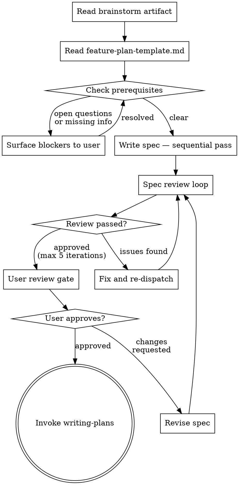

# Writing a Spec from a Brainstorm Artifact

Translate a brainstorm artifact into a formal SDD spec. This skill starts with fresh context — the brainstorm conversation history is not in scope. The artifact is the sole input. This separation is intentional: it prevents context pollution from the exploratory brainstorm session from scrambling the structured output.

## HARD-GATE

<HARD-GATE>
Do NOT invoke writing-plans until the spec has passed the review loop AND the user has approved it. A spec with unresolved issues MUST NOT proceed to planning.
</HARD-GATE>

## Process Flow



## Checklist

1. **Read the brainstorm artifact** — this is your primary input
2. **Read `docs/templates/feature-plan-template.md`** — this is your output scaffold
3. **Check prerequisites** — are all Open Questions resolved? Is scope clear?
4. **Write the spec** — sequential pass, one section at a time
5. **Spec review loop** — dispatch reviewer, fix, repeat until approved (max 5 iterations)
6. **User review gate** — present the spec, wait for approval
7. **Invoke writing-plans** — the only skill you invoke after the spec is approved

## Step 1: Read Inputs

Read both files before writing anything:

```bash
# Brainstorm artifact (path passed from brainstorming skill, or find it)
cat docs/brainstorms/YYYY-MM-DD-<topic>-brainstorm.md

# Template
cat docs/templates/feature-plan-template.md
```

If `docs/templates/feature-plan-template.md` does not exist, check `docs/templates/` for any file named `*feature*` or `*plan*template*`. If none found, check `~/.claude/plugins/marketplaces/superpowers-dev/docs/` or ask the user.

## Step 2: Check Prerequisites

Before writing, verify:

- [ ] All Open Questions in the artifact are resolved (the list is empty or all items are checked off)
- [ ] Sprint goal is a single sentence, scoped for one PR
- [ ] Candidate FEAT-IDs are ≤ 5
- [ ] Each FEAT-ID describes exactly one behavior (no "and" in the description — if present, split it)
- [ ] Scope has both explicit In Scope and explicit Out of Scope

If any prerequisite fails, surface to the user and wait for resolution. Do not write a spec with known gaps.

## Step 3: Write the Spec — Sequential Pass

**Write the entire spec in a single file write.** Do not write a skeleton and fill it in — write each section completely before moving to the next, then commit the whole file at once.

Save to `docs/specs/YYYY-MM-DD-<topic>-design.md`. Project preferences override this default.

Write sections **in this exact order**:

1. **Header** — title, date, status (DRAFT), prerequisites, supersedes (if any), closes (GitHub issue if known)
2. **Problem Statement** — grounded, verified, with file:line references from the artifact's Technical Discoveries
3. **Objective** — one paragraph: what this sprint accomplishes and why
4. **Scope**
   - In Scope: explicit list from artifact
   - Out of Scope: explicit list from artifact (everything excluded during brainstorm)
5. **Dependencies** — prerequisites from artifact
6. **Design / Architecture** — technical approach selected, key structural decisions
7. **Specifications** — one block per FEAT-ID, in order:
   ```
   ### FEAT-001: [Name]
   - **SHALL**: [required behavior — RFC 2119]
   - **SHALL NOT**: [forbidden behavior — RFC 2119]
   - **SHOULD**: [recommended behavior]

   #### Examples
   | Input | Expected Output |
   |-------|----------------|
   | [concrete input] | [concrete output] |
   | [edge case] | [error or boundary behavior] |
   ```
8. **Test Plan** — what tests verify each FEAT-ID; reference the Examples tables
9. **Validation Procedure** — how to verify the implementation is correct before merge (staging gates, recall checks, etc.)
10. **API Verification Table** (if the spec calls existing methods):
    ```
    | Symbol | Location (verified) | Used in |
    |--------|--------------------| --------|
    | ClassName.method | file.py:N | FEAT-001 |
    ```

**Do not go back and insert content into earlier sections after you have moved past them.** Write forward only.

## Step 4: Spec Review Loop

After writing, dispatch the spec reviewer. Read `skills/writing-spec/spec-document-reviewer-prompt.md` for the exact dispatch template.

```
Max 5 iterations. If still unresolved after 5, surface to the user with a summary of outstanding issues.
```

Dispatch with:
- The spec file path
- The brainstorm artifact path (for context on intent)
- The project name (for Agent Brain CLI)

Fix issues found, re-dispatch until approved.

## Step 5: User Review Gate

Once the review loop passes:

> "Spec written and reviewed — saved to `<path>`. Please review before we start writing the implementation plan. Pay particular attention to the Examples tables (these become your tests) and the Out of Scope list (this is what the implementer is forbidden from adding)."

Wait for explicit approval. If changes are requested, make them and re-run the review loop (not just re-dispatch the reviewer once — full loop).

## Step 6: Invoke writing-plans

Once the user approves, invoke the `writing-plans` skill. Pass the spec file path.

**The only skill you invoke after the spec is approved is `writing-plans`.**

## Key Rules

**One write, forward only** — Write the spec in a single sequential pass. The scrambled output problem in older specs was caused by multiple partial writes and insertions into earlier sections. Avoid it by writing completely and committing once.

**Artifact is the source of truth** — If something is not in the brainstorm artifact, do not invent it. If you notice a gap (a FEAT-ID that needs a behavior the artifact doesn't specify), surface it to the user before writing, not after.

**RFC 2119 discipline** — Every behavioral requirement uses SHALL, SHALL NOT, SHOULD, MAY, or SHOULD NOT. Avoid "will", "must", "needs to" — they are ambiguous. If you can't write a requirement in RFC 2119 terms, the requirement is not precise enough to spec.

**Examples tables are not optional** — Every FEAT-ID needs at least one Examples table row for the happy path and one for the primary error/edge case. These map directly to pytest.parametrize. If you can't write a concrete example, the spec is not ready.

**Examples rows are BUILD-OPERATE-CHECK triples** — Each row in an Examples table encodes one test: the Input column is what you BUILD and pass to the system (OPERATE), the Expected Output column is what you CHECK. When writing rows, think: "what exactly would I construct, call, and assert?" A vague input like "invalid data" is not a valid row — use the actual value that triggers the behavior (e.g., `email=""`, `count=-1`). Implementers will transcribe these directly into pytest.parametrize; make them exact.

**Verify before citing** — If the spec cites a file path, method, or line number from the codebase, verify it exists before writing. Use `agent-brain-cli impact <project> <symbol>` or read the file directly. A spec that invents an API call corrupts every downstream artifact.
